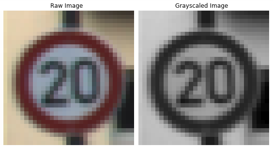
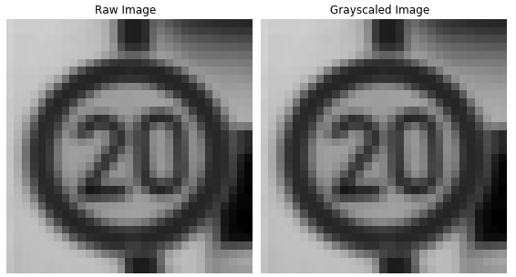
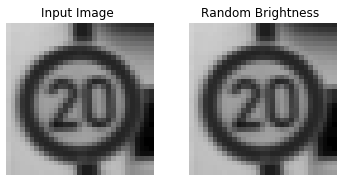
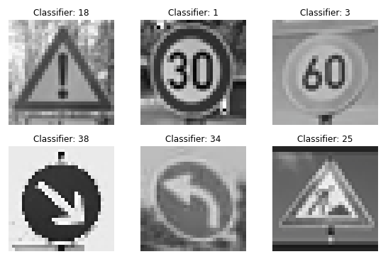
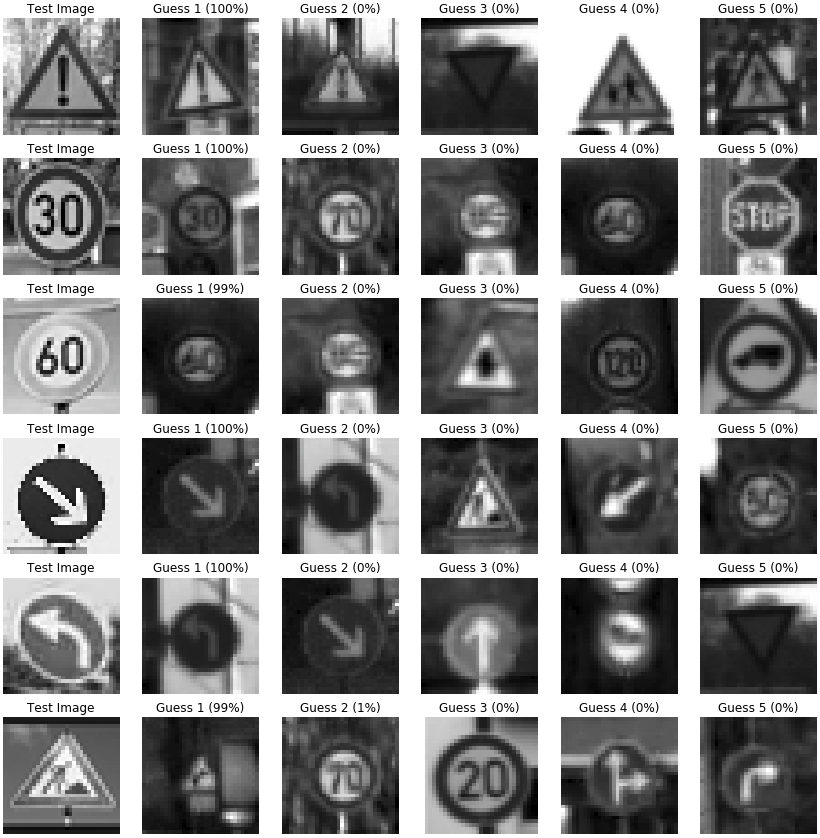

# **Traffic Sign Recognition** 

This project explores how to use TensorFlow to train a neural network to recognize German traffic signs. A data set provided by Udacity contains a large sample set of 32x32 images and their corresponding classifer. The goals for this project are to :

* Load the data set (see below for links to the project data set)
* Explore, summarize and visualize the data set
* Design, train and test a model architecture
* Use the model to make predictions on new images
* Analyze the softmax probabilities of the new images
* Summarize the results with a written report

---
## Data Set Summary & Exploration

### 1. Basic summary of the data set.

* The size of training set is 34799.
* The size of the validation set is 4410.
* The size of test set is 12630.
* The shape of a traffic sign image is 32x32x3.
* The number of unique classes/labels in the data set is 43.

### 2. Visualization of the data set.

The original data set contained an uneven distribution of images amoungst the traffic sign classes with the minimum  of 180 and a maximum of 2010 images in a single class. The histogram below shows the frequency of images in each of the data sets (training, validation, testing) with the frequency of on the y-axis and sign classification on the x-axis.

  

---
## Design & Test a Model Architecture

### 1. Preprocessing the Data Set

#### Grayscaling the Images
The images were converted to grayscale reducing their size from 32x32x3 to 32x32x1 which ultimately reduces the overhead for the neural network by a third. Grayscale allows an image to be represented as shades and can better be converted into gradients than if using an RGB image. Since TensorFlow is looking for a variable of size (?, 32, 32, 1) to train the network, I experienced issues with image size when converting to scale with OpenCV since it deemed the fourth dimension of '1' unnecessary and returned an image set of size (?, 32, 32) which is incompatible. Instead, I used numpy.sum() with option `keepdims=True` to average the three colour channels to a single value while maintaining a compatible shape. 

  

#### Normalize the Images
The grayscaled images were normalized from range (0,255) to (-1,1) to reduce computation when training the network.

  

#### Augment Training Data Set
Since the data set was unevenly distributed, my worry was that the network would train more on certain signs more than others. To even the playing field I simply concatenated the images of each class to themselves until they reached a minimum threshold provided (4000 in my case) so that all the classes would have an equal prediction accuracy.

  

### 2. Model Architecture

| Layer         		|     Description	        					| 
|:---------------------:|:---------------------------------------------:| 
| Input         		| 32x32x1 Grayscale image   							| 
| Convolution 3x3     	| 1x1 stride, valid padding, outputs 28x28x6 	|
| RELU					|												|
| Convolution 3x3     	| 1x1 stride, valid padding, outputs 14x14x6 	|
| RELU					|												|
| Max pooling	      	| 2x2 stride,  outputs 5x5x16 				|
| Convolution 3x3     	| 1x1 stride, valid padding, outputs 1x1x400 	|
| RELU					|												|
| Flatten          | outputs 400  |
| Concatenate      | outputs 800  |
| Dropout          |   | 
| Fully connected		| outputs 43					|

 

### 3. Training Model

To train the model several steps were performed to randomize the data before each epoch that included shuffling, rotating, and altering the brightness randomly. The images and labels were shuffled to prevent the model from learning the order of the images and to reduce the probability of getting multiple images of the same time in a row since the raw data sets are organized in clumps. Since there are multiple of the same images in the data set from the augmentation step to even out the frequencies of each image, we need to differentiate the images from each other by applying a random rotation and randomly adjusting the brightness.

  

  

The training parameters used did not differ much from the LeNet lab, with exception to a slightly lower learning rate and several more epochs to account for the lower rate.

| **Parameter**        		|     **Value**	  	| 
|:---------------------:|:-----------------:| 
| Sigma | 0.1 |
| Mu | 0 |
| Batch Size | 128 |
| Epochs | 30 |
| Learning Rate | 0.0008 |

### 4. Approach for Training Model

Final model results were:
* validation set accuracy of 95.2%
* test set accuracy of 93.0%

... more to come
 

---
## Test a Model on New Images

### 1. German Traffic Signs from the Web

Here are six German traffic signs that I found on the web after grayscale and normalization:

  

### 2. Model Predictions
Here are the results of the prediction:

| Image			        |     Prediction	       | 
|:-----------------:|:----------------------:| 
| General Caution		| General Caution		  	 | 
| 30 km/h      			| 30 km/h								 |
| 60 km/h	  				| 60 km/h								 | 
| Keep Right	   		| Keep Right	  	 			 |
| Left Turn Ahead		| Left Turn Ahead				 |
| Road Work         | Dangerous Curve Right  |

The model was able to correctly guess 5 of the 6 traffic signs, which gives an accuracy of 83.3%. The five images that were classified correctly contained simple geometric shapes, such as arrows and numbers, with relatively large sides for the model to pick up on while the sign that was misclassified had a more complex shape which was distorted by the low photo resolution. Overall, the model predicted the signs very well.

### 3. Model Accuracy
To provide some insight to the model predictions, the below image shows the input image on the left hand side followed by the top five model predictions with their confidence level in percent. For the first five images it can be seen that the model predicted the sign classification correctly with 100.0% confidence while showing 0.0% for the remaining images, however the last image was misclassified and showed a 99.0% confidence. 

  

