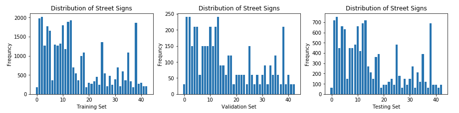
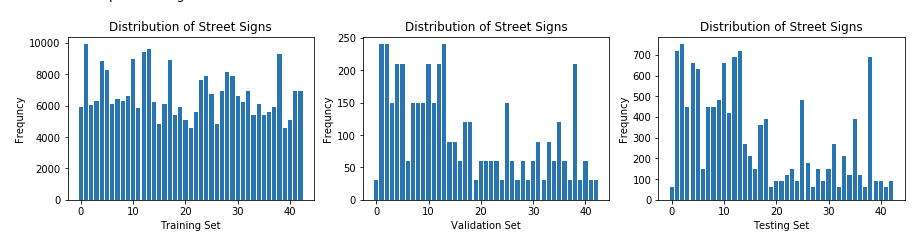
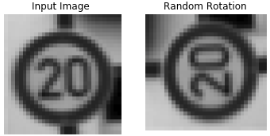

# **Traffic Sign Recognition** 

This project explores how to use TensorFlow to train a neural network to recognize German traffic signs. A data set provided by Udacity contains a large sample set of 32x32 images and their corresponding classifer. The goals for this project are to :

* Load the data set (see below for links to the project data set)
* Explore, summarize and visualize the data set
* Design, train and test a model architecture
* Use the model to make predictions on new images
* Analyze the softmax probabilities of the new images
* Summarize the results with a written report

---
## Data Set Summary & Exploration

### 1. Basic summary of the data set.

* The size of training set is 34799.
* The size of the validation set is 4410.
* The size of test set is 12630.
* The shape of a traffic sign image is 32x32x3.
* The number of unique classes/labels in the data set is 43.

#### 2. Visualization of the data set.

The original data set contained an uneven distribution of images amoungst the traffic sign classes with the minimum  of 180 and a maximum of 2010 images in a single class. The histogram below shows the frequency of images in each of the data sets (training, validation, testing) with the frequency of on the y-axis and sign classification on the x-axis.

  

---
## Design & Test a Model Architecture

### 1. Preprocessing the Data Set

#### Grayscaling the Images
The images were converted to grayscale reducing their size from 32x32x3 to 32x32x1 which ultimately reduces the overhead for the neural network by a third. Grayscale allows an image to be represented as shades and can better be converted into gradients than if using an RGB image. Since TensorFlow is looking for a variable of size (?, 32, 32, 1) to train the network, I experienced issues with image size when converting to scale with OpenCV since it deemed the fourth dimension of '1' unnecessary and returned an image set of size (?, 32, 32) which is incompatible. Instead, I used numpy.sum() with option `keepdims=True` to average the three colour channels to a single value while maintaining a compatible shape. 

  

#### Normalize the Images
The grayscaled images were normalized from range (0,255) to (-1,1) ...

  

#### Augment Training Data Set
Since the data set was unevenly distributed, my worry was that the network would train more on certain signs more than others. To even the playing field I simply concatenated the images of each class to themselves until they reached a minimum threshold provided (4000 in my case) so that all the classes would have an equal prediction accuracy.

  

#### 2. Model Architecture

| Layer         		|     Description	        					| 
|:---------------------:|:---------------------------------------------:| 
| Input         		| 32x32x1 Grayscale image   							| 
| Convolution 3x3     	| 1x1 stride, valid padding, outputs 28x28x6 	|
| RELU					|												|
| Convolution 3x3     	| 1x1 stride, valid padding, outputs 14x14x6 	|
| RELU					|												|
| Max pooling	      	| 2x2 stride,  outputs 5x5x16 				|
| Convolution 3x3     	| 1x1 stride, valid padding, outputs 1x1x400 	|
| RELU					|												|
| Flatten          | outputs 400  |
| Concatenate      | outputs 800  |
| Dropout          |   | 
| Fully connected		| outputs 43					|

 

#### 3. Training Model

To train the model several steps were performed to randomize the data before each epoch that included shuffling, rotating, and altering the brightness randomly. The images and labels were shuffled to prevent the model from learning the order of the images and to reduce the probability of getting multiple images of the same time in a row since the raw data sets are organized in clumps. Since there are multiple of the same images in the data set from the augmentation step to even out the frequencies of each image, we need to differentiate the images from each other by applying a random rotation (left) and randomly adjusting the brightness (right).

  
  

The training parameters used did not differ much from the LeNet lab, with exception to a slightly lower learning rate and several more epochs to account for the lower rate.

| **Parameter**        		|     **Value**	  	| 
|:---------------------:|:-----------------:| 
| Sigma | 0.1 |
| Mu | 0 |
| Batch Size | 128 |
| Epochs | 30 |
| Learning Rate | 0.0008 |

#### 4. Describe the approach taken for finding a solution and getting the validation set accuracy to be at least 0.93. Include in the discussion the results on the training, validation and test sets and where in the code these were calculated. Your approach may have been an iterative process, in which case, outline the steps you took to get to the final solution and why you chose those steps. Perhaps your solution involved an already well known implementation or architecture. In this case, discuss why you think the architecture is suitable for the current problem.

My final model results were:
* training set accuracy of 95.2%
* validation set accuracy of 95.2%
* test set accuracy of 93.0%

If an iterative approach was chosen:
* What was the first architecture that was tried and why was it chosen?
* What were some problems with the initial architecture?
* How was the architecture adjusted and why was it adjusted? Typical adjustments could include choosing a different model architecture, adding or taking away layers (pooling, dropout, convolution, etc), using an activation function or changing the activation function. One common justification for adjusting an architecture would be due to overfitting or underfitting. A high accuracy on the training set but low accuracy on the validation set indicates over fitting; a low accuracy on both sets indicates under fitting.
* Which parameters were tuned? How were they adjusted and why?
* What are some of the important design choices and why were they chosen? For example, why might a convolution layer work well with this problem? How might a dropout layer help with creating a successful model?

If a well known architecture was chosen:
* What architecture was chosen?
* Why did you believe it would be relevant to the traffic sign application?
* How does the final model's accuracy on the training, validation and test set provide evidence that the model is working well?
 

### Test a Model on New Images

#### 1. Choose five German traffic signs found on the web and provide them in the report. For each image, discuss what quality or qualities might be difficult to classify.

Here are five German traffic signs that I found on the web:

![alt text][image4] ![alt text][image5] ![alt text][image6] 
![alt text][image7] ![alt text][image8]

The first image might be difficult to classify because ...

#### 2. Discuss the model's predictions on these new traffic signs and compare the results to predicting on the test set. At a minimum, discuss what the predictions were, the accuracy on these new predictions, and compare the accuracy to the accuracy on the test set (OPTIONAL: Discuss the results in more detail as described in the "Stand Out Suggestions" part of the rubric).

Here are the results of the prediction:

| Image			        |     Prediction	        					| 
|:---------------------:|:---------------------------------------------:| 
| Stop Sign      		| Stop sign   									| 
| U-turn     			| U-turn 										|
| Yield					| Yield											|
| 100 km/h	      		| Bumpy Road					 				|
| Slippery Road			| Slippery Road      							|

The model was able to correctly guess 4 of the 5 traffic signs, which gives an accuracy of 80%. This compares favorably to the accuracy on the test set of ...

#### 3. Describe how certain the model is when predicting on each of the five new images by looking at the softmax probabilities for each prediction. Provide the top 5 softmax probabilities for each image along with the sign type of each probability. (OPTIONAL: as described in the "Stand Out Suggestions" part of the rubric, visualizations can also be provided such as bar charts)

The code for making predictions on my final model is located in the 11th cell of the Ipython notebook.

For the first image, the model is relatively sure that this is a stop sign (probability of 0.6), and the image does contain a stop sign. The top five soft max probabilities were

| Probability         	|     Prediction	        					| 
|:---------------------:|:---------------------------------------------:| 
| .60         			| Stop sign   									| 
| .20     				| U-turn 										|
| .05					| Yield											|
| .04	      			| Bumpy Road					 				|
| .01				    | Slippery Road      							|

For the second image ... 

### (Optional) Visualizing the Neural Network (See Step 4 of the Ipython notebook for more details)
#### 1. Discuss the visual output of your trained network's feature maps. What characteristics did the neural network use to make classifications?

